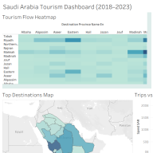
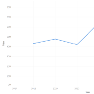
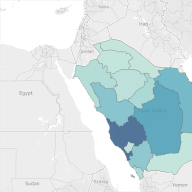
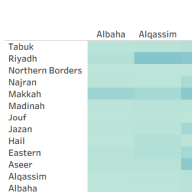
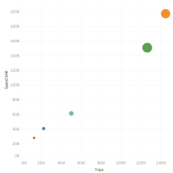

# 🗺️ Saudi Arabia Tourism Data Visualization

A multi-view Tableau dashboard analyzing domestic tourism flows across Saudi Arabia from 2018–2023, built on a real-world dataset of over 30,000 tourism records.

## Overview



The dashboard explores domestic tourism behavior across Saudi provinces — trip volume, spending, travel purpose, and origin-destination patterns — combining temporal, geographic, and categorical views into a single coherent story.

## Dataset

[Saudi Arabia Tourism and Climate Data (2018–2023)](https://www.kaggle.com/datasets/mohammedomarhalawani/saudiarabia-tourism-and-climate-data-20182023/data) (Kaggle) — ~30,851 records covering domestic tourism flows between provinces, including trip counts, visitor spending, nights stayed, visit purpose, and temperature data for both origin and destination.

| Attribute | Type | Description |
|---|---|---|
| year | Temporal | 2018–2023 |
| month | Ordinal | Numeric month (1–12) |
| originProvinceNameEn / destinationProvinceNameEn | Categorical | Origin / destination province |
| visitPurposeEn | Categorical | Leisure, Business, or VFR |
| trips | Quantitative | Number of trips |
| spendSAR | Quantitative | Visitor spending (SAR) |
| nights | Quantitative | Number of nights |
| origin_temp / destination_temp | Quantitative | Temperature at origin / destination |

## Data Preparation

- Mapped province names to Tableau's geographic naming system (e.g. `Alqassim` → `Al Qasim`, `Eastern` → `Ash Sharqiyah`, `Jouf` → `Al Jawf`, `Madinah` → `Al Madinah`, `Riyadh` → `Ar Riyad`)
- Set `trips`, `spendSAR`, and `nights` as quantitative measures
- Assigned origin and destination provinces the State/Province geographic role
- Checked for missing values and outliers

## Views

### Trips Trend (2018–2023)


A line chart tracking total trips over time — chosen over a bar chart because it shows growth and directional change more smoothly for time-series data.

### Top Destinations Map


A filled geographic map colored by trip volume, with an action filter so clicking a province filters the whole dashboard. Makes spatial concentration (e.g. Makkah, Riyadh) immediately visible.

### Origin → Destination Tourism Flow Heatmap


A matrix of origin vs. destination provinces, colored by trip volume, to reveal the strongest regional travel connections at a glance.

### Trips vs. Spending Scatter Plot


Trips plotted against spending, colored by visit purpose (Leisure / Business / VFR), to explore whether trip volume correlates with spending across different purposes.

## Key Insights

1. Domestic tourism has been steadily increasing, especially after 2020.
2. Makkah, Riyadh, and the Eastern Province consistently rank as top destinations.
3. Strong travel flows exist between geographically close regions.
4. Leisure trips dominate spending, particularly during peak seasons.
5. Leisure trips represent the highest spending category, followed by VFR (Visiting Friends and Relatives); Business trips show the lowest and most consistent spending.

## Tech Stack

- **Tool:** Tableau
- **Data:** CSV (province-level domestic tourism records)

## Project Structure

```
tourism-dashboard/
├── tourism_dashboard.twbx   # Tableau packaged workbook
├── data/
│   └── tourism_with_temps.csv
├── images/
│   ├── dashboard_overview.png
│   ├── trips_trend.png
│   ├── top_destinations_map.png
│   ├── tourism_flow_heatmap.png
│   └── trips_vs_spending.png
└── README.md
```

## How to View

Open `tourism_dashboard.twbx` in [Tableau Desktop](https://www.tableau.com/products/desktop) or [Tableau Reader](https://www.tableau.com/products/reader) (free) to explore the interactive dashboard.

## Author

**Rawan Mansour**
This was a team project.
